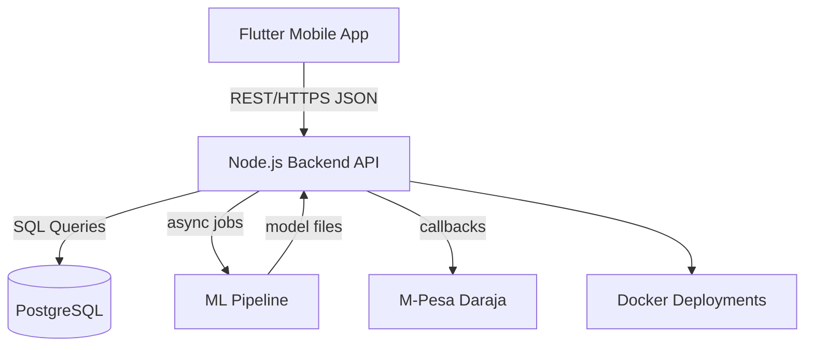

# BajetiBuddy Architecture Overview

This document summarizes how the pieces of BajetiBuddy fit together from the mobile application to the backend, machine learning models and deployment stack.

## Component Flow

1. **Mobile App ⇄ Backend** – The Flutter application communicates with the Express API over HTTPS using JSON payloads.
2. **Backend ⇄ Database** – Persistent data is stored in PostgreSQL while Redis may be used for caching and queues.
3. **Backend ⇄ ML Models** – Long running tasks trigger Python scripts which train or query models. Results are returned to the API as JSON.
4. **Backend ⇄ M-Pesa** – Payment events arrive via webhooks. The backend validates and reconciles transactions.
5. **Deployment Flow** – Docker images are built and pushed to the cloud. Nginx proxies traffic to the Node.js service.

The overall interaction ensures mobile clients remain lightweight while heavy processing is offloaded to the backend and ML pipeline.

